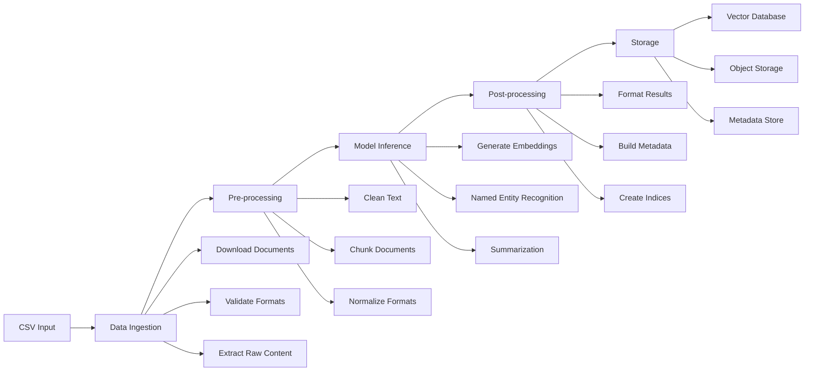

# AI Pipeline Implementation Guide

This guide provides a complete implementation of a document processing pipeline for RAG (Retrieval-Augmented Generation) with proper AI/ML pipeline steps.

## Why Temporal for This Pipeline

Temporal is uniquely suited for AI pipelines because:
- **Resilience**: Automatic recovery from API failures and rate limits during embedding generation
- **Long-running**: Process massive datasets over hours or days without timeouts
- **Observable**: Complete audit trail of every embedding generation and model inference
- **Scalable**: Add workers to handle increased load seamlessly
- **Versioning**: Safely evolve models without disrupting in-flight workflows
- **Human-in-the-Loop**: Pause workflows for quality review when needed

## Pipeline Architecture



## Pipeline Steps

### 1. Data Ingestion
- **Purpose**: Acquire and validate input documents
- **Activities**:
  - Parse CSV input file
  - Download documents from URLs
  - Validate document formats (PDF, DOCX, TXT, HTML)
  - Extract raw binary content
  - Handle errors and retries

### 2. Pre-processing
- **Purpose**: Prepare documents for AI model processing
- **Activities**:
  - Extract text from various formats (PDR parsing, OCR)
  - Clean and normalize text
  - Split into optimal chunks (1000-2000 tokens)
  - Remove personally identifiable information (PII)
  - Language detection and filtering

### 3. Model Inference
- **Purpose**: Apply AI models to extract insights
- **Activities**:
  - Generate vector embeddings (OpenAI, Sentence Transformers)
  - Extract named entities (spaCy, Hugging Face)
  - Generate summaries (GPT-4, Claude)
  - Classify document types
  - Extract key phrases and topics

**Why Temporal Excels at Model Inference**:
- **Automatic Retries**: Handle transient API failures and rate limits seamlessly
- **Cost Tracking**: Monitor API usage per workflow execution
- **Model Versioning**: Track which model version generated each embedding
- **Parallel Processing**: Process multiple documents concurrently
- **Human Review**: Pause for quality checks when confidence is low

### 4. Post-processing
- **Purpose**: Format and enrich results for storage
- **Activities**:
  - Combine inference results
  - Build comprehensive metadata
  - Create search indices
  - Generate quality scores
  - Prepare for different storage formats

### 5. Storage
- **Purpose**: Persist processed data for retrieval
- **Activities**:
  - Store embeddings in vector database
  - Save documents to object storage
  - Update metadata database
  - Create audit logs
  - Generate processing reports

## Implementation Structure

### Go Implementation

```
/temporal-rag-pipeline-go/
├── cmd/
│   ├── worker/
│   │   └── main.go              # Worker entry point
│   ├── starter/
│   │   └── main.go              # Workflow starter
│   └── server/
│       └── main.go              # Local test server
├── internal/
│   ├── workflows/
│   │   └── document_pipeline.go # Main workflow
│   ├── activities/
│   │   ├── ingestion/
│   │   │   ├── csv_parser.go
│   │   │   ├── downloader.go
│   │   │   └── validator.go
│   │   ├── preprocessing/
│   │   │   ├── text_extractor.go
│   │   │   ├── chunker.go
│   │   │   └── cleaner.go
│   │   ├── inference/
│   │   │   ├── embeddings.go
│   │   │   ├── ner.go
│   │   │   └── summarizer.go
│   │   ├── postprocessing/
│   │   │   ├── formatter.go
│   │   │   └── metadata.go
│   │   └── storage/
│   │       ├── vectordb.go
│   │       ├── s3.go
│   │       └── metadata.go
│   ├── models/
│   │   └── types.go             # Data structures
│   └── mocks/
│       ├── llm.go               # Mock LLM service
│       └── storage.go           # Mock storage
├── config/
│   └── config.go                # Configuration
├── docker/
│   ├── docker-compose.yml       # Local services
│   └── Dockerfile              # Worker image
├── Makefile                    # Build commands
├── go.mod
└── go.sum
```

### Java Implementation

```
/temporal-rag-pipeline-java/
├── gradle/
│   └── wrapper/
├── src/
│   ├── main/
│   │   ├── java/
│   │   │   └── com/example/
│   │   │       ├── TemporalRagApplication.java
│   │   │       ├── workflows/
│   │   │       │   └── DocumentPipelineWorkflow.java
│   │   │       ├── activities/
│   │   │       │   ├── ingestion/
│   │   │       │   │   ├── CsvParserActivity.java
│   │   │       │   │   ├── DocumentDownloader.java
│   │   │       │   │   └── FormatValidator.java
│   │   │       │   ├── preprocessing/
│   │   │       │   │   ├── TextExtractor.java
│   │   │       │   │   ├── DocumentChunker.java
│   │   │       │   │   └── TextCleaner.java
│   │   │       │   ├── inference/
│   │   │       │   │   ├── EmbeddingGenerator.java
│   │   │       │   │   ├── NamedEntityRecognizer.java
│   │   │       │   │   └── Summarizer.java
│   │   │       │   ├── postprocessing/
│   │   │       │   │   ├── ResultFormatter.java
│   │   │       │   │   └── MetadataBuilder.java
│   │   │       │   └── storage/
│   │   │       │       ├── VectorDBStorage.java
│   │   │       │       ├── S3Storage.java
│   │   │       │       └── MetadataStorage.java
│   │   │       ├── models/
│   │   │       │   └── DocumentModels.java
│   │   │       ├── config/
│   │   │       │   └── ApplicationConfig.java
│   │   │       └── mocks/
│   │   │           └── MockServices.java
│   │   └── resources/
│   │       └── application.yml
│   └── test/
│       └── java/
│           └── com/example/
│               └── workflows/
│                   └── DocumentPipelineTest.java
├── docker/
│   ├── docker-compose.yml
│   └── Dockerfile
├── build.gradle
├── settings.gradle
└── gradlew
```

## Local Development Environment

### Docker Compose Setup

```yaml
version: '3.8'

services:
  # Temporal Server
  temporal:
    image: temporalio/auto-setup:1.22.4
    ports:
      - "7233:7233"
    environment:
      - LOG_LEVEL=warn
      - DYNAMIC_CONFIG_FILE_PATH=config/dynamicconfig/development-sql.yaml
    volumes:
      - ./dynamicconfig:/etc/temporal/config/dynamicconfig
    networks:
      - temporal-network

  # Temporal UI
  temporal-ui:
    image: temporalio/ui:2.21.3
    environment:
      - TEMPORAL_ADDRESS=temporal:7233
      - TEMPORAL_CORS_ORIGINS=http://localhost:3000
    ports:
      - "8080:8080"
    depends_on:
      - temporal
    networks:
      - temporal-network

  # MinIO (S3 Compatible Storage)
  minio:
    image: minio/minio:latest
    ports:
      - "9000:9000"
      - "9001:9001"
    environment:
      MINIO_ROOT_USER: minioadmin
      MINIO_ROOT_PASSWORD: minioadmin
    command: server /data --console-address ":9001"
    volumes:
      - minio-data:/data
    networks:
      - temporal-network

  # PostgreSQL (for metadata)
  postgres:
    image: postgres:15
    environment:
      POSTGRES_DB: document_metadata
      POSTGRES_USER: postgres
      POSTGRES_PASSWORD: postgres
    ports:
      - "5432:5432"
    volumes:
      - postgres-data:/var/lib/postgresql/data
    networks:
      - temporal-network

  # ChromaDB (Local Vector Database)
  chromadb:
    image: chromadb/chroma:latest
    ports:
      - "8000:8000"
    volumes:
      - chroma-data:/chroma/chroma
    environment:
      - IS_PERSISTENT=TRUE
      - ANONYMIZED_TELEMETRY=FALSE
    networks:
      - temporal-network

  # Redis (for caching)
  redis:
    image: redis:7-alpine
    ports:
      - "6379:6379"
    networks:
      - temporal-network

  # Mock LLM Service (for local testing)
  mock-llm:
    build:
      context: ./mock-services
      dockerfile: Dockerfile.llm
    ports:
      - "8081:8081"
    environment:
      - PORT=8081
      - MOCK_DELAY_MS=100
    networks:
      - temporal-network

volumes:
  minio-data:
  postgres-data:
  chroma-data:

networks:
  temporal-network:
    driver: bridge
```

### Mock LLM Service

For local testing without API costs, we provide a mock LLM service:

```go
// mock-services/llm/main.go
package main

import (
    "encoding/json"
    "fmt"
    "log"
    "math/rand"
    "net/http"
    "strings"
    "time"
)

type EmbeddingRequest struct {
    Model string   `json:"model"`
    Input string   `json:"input"`
}

type EmbeddingResponse struct {
    Data []struct {
        Embedding []float32 `json:"embedding"`
    } `json:"data"`
}

type CompletionRequest struct {
    Model    string `json:"model"`
    Messages []struct {
        Role    string `json:"role"`
        Content string `json:"content"`
    } `json:"messages"`
}

type CompletionResponse struct {
    Choices []struct {
        Message struct {
            Content string `json:"content"`
        } `json:"message"`
    } `json:"choices"`
}

func main() {
    http.HandleFunc("/v1/embeddings", handleEmbeddings)
    http.HandleFunc("/v1/chat/completions", handleCompletions)
    
    port := "8081"
    log.Printf("Mock LLM service listening on port %s", port)
    log.Fatal(http.ListenAndServe(":"+port, nil))
}

func handleEmbeddings(w http.ResponseWriter, r *http.Request) {
    var req EmbeddingRequest
    if err := json.NewDecoder(r.Body).Decode(&req); err != nil {
        http.Error(w, err.Error(), http.StatusBadRequest)
        return
    }
    
    // Generate mock embedding (1536 dimensions for OpenAI compatibility)
    embedding := make([]float32, 1536)
    for i := range embedding {
        embedding[i] = rand.Float32()*2 - 1 // Random values between -1 and 1
    }
    
    resp := EmbeddingResponse{
        Data: []struct {
            Embedding []float32 `json:"embedding"`
        }{
            {Embedding: embedding},
        },
    }
    
    w.Header().Set("Content-Type", "application/json")
    json.NewEncoder(w).Encode(resp)
}

func handleCompletions(w http.ResponseWriter, r *http.Request) {
    var req CompletionRequest
    if err := json.NewDecoder(r.Body).Decode(&req); err != nil {
        http.Error(w, err.Error(), http.StatusBadRequest)
        return
    }
    
    // Generate mock response based on input
    content := req.Messages[len(req.Messages)-1].Content
    var response string
    
    if strings.Contains(content, "summarize") {
        response = fmt.Sprintf("This is a mock summary of the document. The document contains %d words and discusses various topics related to the content provided.", 
            len(strings.Fields(content)))
    } else if strings.Contains(content, "entities") {
        response = `{"entities": [{"text": "John Doe", "type": "PERSON"}, {"text": "Acme Corp", "type": "ORG"}, {"text": "New York", "type": "LOC"}]}`
    } else {
        response = "This is a mock response from the LLM service."
    }
    
    resp := CompletionResponse{
        Choices: []struct {
            Message struct {
                Content string `json:"content"`
            } `json:"message"`
        }{
            {Message: struct {
                Content string `json:"content"`
            }{Content: response}},
        },
    }
    
    // Simulate processing delay
    time.Sleep(100 * time.Millisecond)
    
    w.Header().Set("Content-Type", "application/json")
    json.NewEncoder(w).Encode(resp)
}
```

## Build Configuration

### Go Build (Makefile)

```makefile
# Makefile
.PHONY: all build test run-worker run-starter docker-up docker-down clean

# Variables
BINARY_NAME=temporal-rag
DOCKER_COMPOSE=docker-compose -f docker/docker-compose.yml

# Build
all: test build

build:
	go build -o bin/worker ./cmd/worker
	go build -o bin/starter ./cmd/starter

test:
	go test -v ./...

test-integration:
	go test -v -tags=integration ./...

# Run
run-worker:
	go run ./cmd/worker/main.go

run-starter:
	go run ./cmd/starter/main.go --csv-file ./testdata/documents.csv

# Docker
docker-up:
	$(DOCKER_COMPOSE) up -d

docker-down:
	$(DOCKER_COMPOSE) down

docker-logs:
	$(DOCKER_COMPOSE) logs -f

# Development
dev: docker-up
	air -c .air.toml

# Clean
clean:
	go clean
	rm -rf bin/

# Install dependencies
deps:
	go mod download
	go install github.com/cosmtrek/air@latest

# Format code
fmt:
	go fmt ./...
	gofumpt -w .

# Lint
lint:
	golangci-lint run

# Generate mocks
mocks:
	mockgen -source=internal/services/interfaces.go -destination=internal/mocks/services.go
```

### Java Build (Gradle)

```gradle
// build.gradle
plugins {
    id 'java'
    id 'org.springframework.boot' version '3.2.0'
    id 'io.spring.dependency-management' version '1.1.4'
    id 'com.github.johnrengelman.shadow' version '8.1.1'
}

group = 'com.example'
version = '1.0.0'
sourceCompatibility = '17'

repositories {
    mavenCentral()
}

dependencies {
    // Spring Boot
    implementation 'org.springframework.boot:spring-boot-starter'
    implementation 'org.springframework.boot:spring-boot-starter-web'
    
    // Temporal
    implementation 'io.temporal:temporal-sdk:1.22.3'
    implementation 'io.temporal:temporal-spring-boot-starter-alpha:1.22.3'
    
    // AI/ML Libraries
    implementation 'com.theokanning.openai-gpt3-java:service:0.18.2'
    implementation 'edu.stanford.nlp:stanford-corenlp:4.5.5'
    
    // Document Processing
    implementation 'org.apache.pdfbox:pdfbox:3.0.0'
    implementation 'org.apache.poi:poi-ooxml:5.2.4'
    implementation 'org.jsoup:jsoup:1.17.1'
    
    // Storage
    implementation 'com.amazonaws:aws-java-sdk-s3:1.12.261'
    implementation 'org.postgresql:postgresql:42.7.1'
    
    // Utils
    implementation 'org.projectlombok:lombok:1.18.30'
    annotationProcessor 'org.projectlombok:lombok:1.18.30'
    implementation 'com.fasterxml.jackson.core:jackson-databind:2.16.0'
    implementation 'org.apache.commons:commons-lang3:3.14.0'
    
    // Testing
    testImplementation 'org.springframework.boot:spring-boot-starter-test'
    testImplementation 'io.temporal:temporal-testing:1.22.3'
    testImplementation 'org.mockito:mockito-core:5.7.0'
    testImplementation 'org.testcontainers:testcontainers:1.19.3'
    testImplementation 'org.testcontainers:postgresql:1.19.3'
}

tasks.named('test') {
    useJUnitPlatform()
}

// Custom tasks
task runWorker(type: JavaExec) {
    classpath = sourceSets.main.runtimeClasspath
    mainClass = 'com.example.worker.DocumentPipelineWorker'
}

task runStarter(type: JavaExec) {
    classpath = sourceSets.main.runtimeClasspath
    mainClass = 'com.example.starter.WorkflowStarter'
    args = ['--csv-file', 'testdata/documents.csv']
}

// Docker build
task buildDocker(type: Exec) {
    commandLine 'docker', 'build', '-t', 'temporal-rag-java:latest', '-f', 'docker/Dockerfile', '.'
}
```

## Running the Examples

### Prerequisites

1. Install Docker and Docker Compose
2. Install language-specific tools:
   - Go: Go 1.21+, Make
   - Java: JDK 17+, Gradle

### Quick Start

#### Go

```bash
# Clone the repository
git clone <repository-url>
cd temporal-rag-pipeline-go

# Start local services
make docker-up

# Install dependencies
make deps

# Run tests
make test

# Start worker in one terminal
make run-worker

# Start workflow in another terminal
make run-starter
```

#### Java

```bash
# Clone the repository
git clone <repository-url>
cd temporal-rag-pipeline-java

# Start local services
docker-compose -f docker/docker-compose.yml up -d

# Run tests
./gradlew test

# Start worker in one terminal
./gradlew runWorker

# Start workflow in another terminal
./gradlew runStarter
```

### Testing with Mock Data

The `testdata/documents.csv` file contains sample documents for testing:

```csv
url,name,type,metadata
https://example.com/doc1.pdf,Technical Specification,pdf,{"category":"engineering","priority":"high"}
https://example.com/doc2.docx,User Manual,docx,{"category":"documentation","language":"en"}
file:///tmp/sample.txt,Sample Text,txt,{"category":"test","processed":false}
```

### Monitoring

1. **Temporal UI**: http://localhost:8080
2. **MinIO Console**: http://localhost:9001 (minioadmin/minioadmin)
3. **ChromaDB API**: http://localhost:8000

## Configuration

### Environment Variables

```bash
# Temporal
TEMPORAL_HOST_URL=localhost:7233
TEMPORAL_NAMESPACE=default
TEMPORAL_TASK_QUEUE=document-pipeline

# Storage
S3_ENDPOINT=http://localhost:9000
S3_ACCESS_KEY=minioadmin
S3_SECRET_KEY=minioadmin
S3_BUCKET=documents

# Database
DB_HOST=localhost
DB_PORT=5432
DB_NAME=document_metadata
DB_USER=postgres
DB_PASSWORD=postgres

# Vector DB
VECTOR_DB_URL=http://localhost:8000
VECTOR_DB_COLLECTION=documents

# AI Services (for production)
OPENAI_API_KEY=your-key-here
ANTHROPIC_API_KEY=your-key-here

# Mock Services (for local testing)
USE_MOCK_LLM=true
MOCK_LLM_URL=http://localhost:8081
```

## Production Deployment

For production deployment, replace mock services with real ones:

1. **LLM Service**: Use OpenAI, Anthropic, or self-hosted models
2. **Vector Database**: Use Pinecone, Weaviate, or Qdrant
3. **Object Storage**: Use AWS S3, Google Cloud Storage, or Azure Blob
4. **Metadata Database**: Use managed PostgreSQL or DynamoDB

See the deployment guide for detailed instructions.