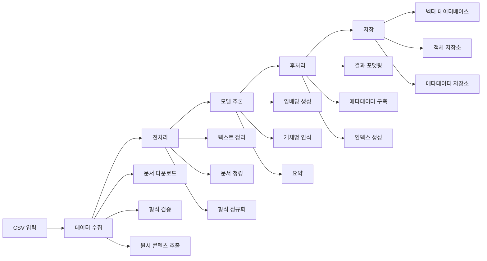

# AI 파이프라인 구현 가이드

이 가이드는 적절한 AI/ML 파이프라인 단계를 포함한 RAG(Retrieval-Augmented Generation)를 위한 문서 처리 파이프라인의 완전한 구현을 제공합니다.

## 이 파이프라인에 Temporal을 사용하는 이유

Temporal은 AI 파이프라인에 독특하게 적합합니다:
- **복원력**: 임베딩 생성 중 API 실패 및 속도 제한으로부터 자동 복구
- **장시간 실행**: 타임아웃 없이 몇 시간 또는 며칠에 걸쳐 대규모 데이터셋 처리
- **관찰 가능성**: 모든 임베딩 생성 및 모델 추론의 완전한 감사 추적
- **확장성**: 부하 증가에 원활하게 대응하기 위해 워커 추가
- **버전 관리**: 진행 중인 워크플로우를 방해하지 않고 안전하게 모델 진화
- **Human-in-the-Loop**: 필요시 품질 검토를 위해 워크플로우 일시 중지

## 파이프라인 아키텍처



## 파이프라인 단계

### 1. 데이터 수집
- **목적**: 입력 문서 획득 및 검증
- **액티비티**:
  - CSV 입력 파일 파싱
  - URL에서 문서 다운로드
  - 문서 형식 검증 (PDF, DOCX, TXT, HTML)
  - 원시 바이너리 콘텐츠 추출
  - 오류 처리 및 재시도

### 2. 전처리
- **목적**: AI 모델 처리를 위한 문서 준비
- **액티비티**:
  - 다양한 형식에서 텍스트 추출 (PDF 파싱, OCR)
  - 텍스트 정리 및 정규화
  - 최적의 청크로 분할 (1000-2000 토큰)
  - 개인 식별 정보(PII) 제거
  - 언어 감지 및 필터링

### 3. 모델 추론
- **목적**: 인사이트 추출을 위한 AI 모델 적용
- **액티비티**:
  - 벡터 임베딩 생성 (OpenAI, Sentence Transformers)
  - 개체명 추출 (spaCy, Hugging Face)
  - 요약 생성 (GPT-4, Claude)
  - 문서 유형 분류
  - 핵심 구문 및 주제 추출

**모델 추론에서 Temporal이 탁월한 이유**:
- **자동 재시도**: 일시적인 API 실패 및 속도 제한을 원활하게 처리
- **비용 추적**: 워크플로우 실행별 API 사용량 모니터링
- **모델 버전 관리**: 각 임베딩을 생성한 모델 버전 추적
- **병렬 처리**: 여러 문서를 동시에 처리
- **인간 검토**: 신뢰도가 낮을 때 품질 검사를 위해 일시 중지

### 4. 후처리
- **목적**: 저장을 위한 결과 포맷팅 및 보강
- **액티비티**:
  - 추론 결과 결합
  - 포괄적인 메타데이터 구축
  - 검색 인덱스 생성
  - 품질 점수 생성
  - 다양한 저장 형식 준비

### 5. 저장
- **목적**: 검색을 위한 처리된 데이터 영속화
- **액티비티**:
  - 벡터 데이터베이스에 임베딩 저장
  - 객체 저장소에 문서 저장
  - 메타데이터 데이터베이스 업데이트
  - 감사 로그 생성
  - 처리 보고서 생성

## 구현 구조

### Go 구현

```
/temporal-rag-pipeline-go/
├── cmd/
│   ├── worker/
│   │   └── main.go              # 워커 진입점
│   ├── starter/
│   │   └── main.go              # 워크플로우 스타터
│   └── server/
│       └── main.go              # 로컬 테스트 서버
├── internal/
│   ├── workflows/
│   │   └── document_pipeline.go # 메인 워크플로우
│   ├── activities/
│   │   ├── ingestion/
│   │   │   ├── csv_parser.go
│   │   │   ├── downloader.go
│   │   │   └── validator.go
│   │   ├── preprocessing/
│   │   │   ├── text_extractor.go
│   │   │   ├── chunker.go
│   │   │   └── cleaner.go
│   │   ├── inference/
│   │   │   ├── embeddings.go
│   │   │   ├── ner.go
│   │   │   └── summarizer.go
│   │   ├── postprocessing/
│   │   │   ├── formatter.go
│   │   │   └── metadata.go
│   │   └── storage/
│   │       ├── vectordb.go
│   │       ├── s3.go
│   │       └── metadata.go
│   ├── models/
│   │   └── types.go             # 데이터 구조
│   └── mocks/
│       ├── llm.go               # 모의 LLM 서비스
│       └── storage.go           # 모의 저장소
├── config/
│   └── config.go                # 구성
├── docker/
│   ├── docker-compose.yml       # 로컬 서비스
│   └── Dockerfile              # 워커 이미지
├── Makefile                    # 빌드 명령
├── go.mod
└── go.sum
```

### Java 구현

```
/temporal-rag-pipeline-java/
├── gradle/
│   └── wrapper/
├── src/
│   ├── main/
│   │   ├── java/
│   │   │   └── com/example/
│   │   │       ├── TemporalRagApplication.java
│   │   │       ├── workflows/
│   │   │       │   └── DocumentPipelineWorkflow.java
│   │   │       ├── activities/
│   │   │       │   ├── ingestion/
│   │   │       │   │   ├── CsvParserActivity.java
│   │   │       │   │   ├── DocumentDownloader.java
│   │   │       │   │   └── FormatValidator.java
│   │   │       │   ├── preprocessing/
│   │   │       │   │   ├── TextExtractor.java
│   │   │       │   │   ├── DocumentChunker.java
│   │   │       │   │   └── TextCleaner.java
│   │   │       │   ├── inference/
│   │   │       │   │   ├── EmbeddingGenerator.java
│   │   │       │   │   ├── NamedEntityRecognizer.java
│   │   │       │   │   └── Summarizer.java
│   │   │       │   ├── postprocessing/
│   │   │       │   │   ├── ResultFormatter.java
│   │   │       │   │   └── MetadataBuilder.java
│   │   │       │   └── storage/
│   │   │       │       ├── VectorDBStorage.java
│   │   │       │       ├── S3Storage.java
│   │   │       │       └── MetadataStorage.java
│   │   │       ├── models/
│   │   │       │   └── DocumentModels.java
│   │   │       ├── config/
│   │   │       │   └── ApplicationConfig.java
│   │   │       └── mocks/
│   │   │           └── MockServices.java
│   │   └── resources/
│   │       └── application.yml
│   └── test/
│       └── java/
│           └── com/example/
│               └── workflows/
│                   └── DocumentPipelineTest.java
├── docker/
│   ├── docker-compose.yml
│   └── Dockerfile
├── build.gradle
├── settings.gradle
└── gradlew
```

## 로컬 개발 환경

### Docker Compose 설정

```yaml
version: '3.8'

services:
  # Temporal 서버
  temporal:
    image: temporalio/auto-setup:1.22.4
    ports:
      - "7233:7233"
    environment:
      - LOG_LEVEL=warn
      - DYNAMIC_CONFIG_FILE_PATH=config/dynamicconfig/development-sql.yaml
    volumes:
      - ./dynamicconfig:/etc/temporal/config/dynamicconfig
    networks:
      - temporal-network

  # Temporal UI
  temporal-ui:
    image: temporalio/ui:2.21.3
    environment:
      - TEMPORAL_ADDRESS=temporal:7233
      - TEMPORAL_CORS_ORIGINS=http://localhost:3000
    ports:
      - "8080:8080"
    depends_on:
      - temporal
    networks:
      - temporal-network

  # MinIO (S3 호환 저장소)
  minio:
    image: minio/minio:latest
    ports:
      - "9000:9000"
      - "9001:9001"
    environment:
      MINIO_ROOT_USER: minioadmin
      MINIO_ROOT_PASSWORD: minioadmin
    command: server /data --console-address ":9001"
    volumes:
      - minio-data:/data
    networks:
      - temporal-network

  # PostgreSQL (메타데이터용)
  postgres:
    image: postgres:15
    environment:
      POSTGRES_DB: document_metadata
      POSTGRES_USER: postgres
      POSTGRES_PASSWORD: postgres
    ports:
      - "5432:5432"
    volumes:
      - postgres-data:/var/lib/postgresql/data
    networks:
      - temporal-network

  # ChromaDB (로컬 벡터 데이터베이스)
  chromadb:
    image: chromadb/chroma:latest
    ports:
      - "8000:8000"
    volumes:
      - chroma-data:/chroma/chroma
    environment:
      - IS_PERSISTENT=TRUE
      - ANONYMIZED_TELEMETRY=FALSE
    networks:
      - temporal-network

  # Redis (캐싱용)
  redis:
    image: redis:7-alpine
    ports:
      - "6379:6379"
    networks:
      - temporal-network

  # 모의 LLM 서비스 (로컬 테스트용)
  mock-llm:
    build:
      context: ./mock-services
      dockerfile: Dockerfile.llm
    ports:
      - "8081:8081"
    environment:
      - PORT=8081
      - MOCK_DELAY_MS=100
    networks:
      - temporal-network

volumes:
  minio-data:
  postgres-data:
  chroma-data:

networks:
  temporal-network:
    driver: bridge
```

### 모의 LLM 서비스

API 비용 없이 로컬 테스트를 위해 모의 LLM 서비스를 제공합니다:

```go
// mock-services/llm/main.go
package main

import (
    "encoding/json"
    "fmt"
    "log"
    "math/rand"
    "net/http"
    "strings"
    "time"
)

type EmbeddingRequest struct {
    Model string   `json:"model"`
    Input string   `json:"input"`
}

type EmbeddingResponse struct {
    Data []struct {
        Embedding []float32 `json:"embedding"`
    } `json:"data"`
}

type CompletionRequest struct {
    Model    string `json:"model"`
    Messages []struct {
        Role    string `json:"role"`
        Content string `json:"content"`
    } `json:"messages"`
}

type CompletionResponse struct {
    Choices []struct {
        Message struct {
            Content string `json:"content"`
        } `json:"message"`
    } `json:"choices"`
}

func main() {
    http.HandleFunc("/v1/embeddings", handleEmbeddings)
    http.HandleFunc("/v1/chat/completions", handleCompletions)
    
    port := "8081"
    log.Printf("Mock LLM service listening on port %s", port)
    log.Fatal(http.ListenAndServe(":"+port, nil))
}

func handleEmbeddings(w http.ResponseWriter, r *http.Request) {
    var req EmbeddingRequest
    if err := json.NewDecoder(r.Body).Decode(&req); err != nil {
        http.Error(w, err.Error(), http.StatusBadRequest)
        return
    }
    
    // 모의 임베딩 생성 (OpenAI 호환성을 위한 1536차원)
    embedding := make([]float32, 1536)
    for i := range embedding {
        embedding[i] = rand.Float32()*2 - 1 // -1과 1 사이의 랜덤 값
    }
    
    resp := EmbeddingResponse{
        Data: []struct {
            Embedding []float32 `json:"embedding"`
        }{
            {Embedding: embedding},
        },
    }
    
    w.Header().Set("Content-Type", "application/json")
    json.NewEncoder(w).Encode(resp)
}

func handleCompletions(w http.ResponseWriter, r *http.Request) {
    var req CompletionRequest
    if err := json.NewDecoder(r.Body).Decode(&req); err != nil {
        http.Error(w, err.Error(), http.StatusBadRequest)
        return
    }
    
    // 입력에 기반한 모의 응답 생성
    content := req.Messages[len(req.Messages)-1].Content
    var response string
    
    if strings.Contains(content, "summarize") {
        response = fmt.Sprintf("이것은 문서의 모의 요약입니다. 문서는 %d개의 단어를 포함하고 제공된 콘텐츠와 관련된 다양한 주제를 다룹니다.", 
            len(strings.Fields(content)))
    } else if strings.Contains(content, "entities") {
        response = `{"entities": [{"text": "John Doe", "type": "PERSON"}, {"text": "Acme Corp", "type": "ORG"}, {"text": "New York", "type": "LOC"}]}`
    } else {
        response = "이것은 LLM 서비스의 모의 응답입니다."
    }
    
    resp := CompletionResponse{
        Choices: []struct {
            Message struct {
                Content string `json:"content"`
            } `json:"message"`
        }{
            {Message: struct {
                Content string `json:"content"`
            }{Content: response}},
        },
    }
    
    // 처리 지연 시뮬레이션
    time.Sleep(100 * time.Millisecond)
    
    w.Header().Set("Content-Type", "application/json")
    json.NewEncoder(w).Encode(resp)
}
```

## 빌드 구성

### Go 빌드 (Makefile)

```makefile
# Makefile
.PHONY: all build test run-worker run-starter docker-up docker-down clean

# 변수
BINARY_NAME=temporal-rag
DOCKER_COMPOSE=docker-compose -f docker/docker-compose.yml

# 빌드
all: test build

build:
	go build -o bin/worker ./cmd/worker
	go build -o bin/starter ./cmd/starter

test:
	go test -v ./...

test-integration:
	go test -v -tags=integration ./...

# 실행
run-worker:
	go run ./cmd/worker/main.go

run-starter:
	go run ./cmd/starter/main.go --csv-file ./testdata/documents.csv

# Docker
docker-up:
	$(DOCKER_COMPOSE) up -d

docker-down:
	$(DOCKER_COMPOSE) down

docker-logs:
	$(DOCKER_COMPOSE) logs -f

# 개발
dev: docker-up
	air -c .air.toml

# 정리
clean:
	go clean
	rm -rf bin/

# 의존성 설치
deps:
	go mod download
	go install github.com/cosmtrek/air@latest

# 코드 포맷팅
fmt:
	go fmt ./...
	gofumpt -w .

# 린트
lint:
	golangci-lint run

# 모의 객체 생성
mocks:
	mockgen -source=internal/services/interfaces.go -destination=internal/mocks/services.go
```

### Java 빌드 (Gradle)

```gradle
// build.gradle
plugins {
    id 'java'
    id 'org.springframework.boot' version '3.2.0'
    id 'io.spring.dependency-management' version '1.1.4'
    id 'com.github.johnrengelman.shadow' version '8.1.1'
}

group = 'com.example'
version = '1.0.0'
sourceCompatibility = '17'

repositories {
    mavenCentral()
}

dependencies {
    // Spring Boot
    implementation 'org.springframework.boot:spring-boot-starter'
    implementation 'org.springframework.boot:spring-boot-starter-web'
    
    // Temporal
    implementation 'io.temporal:temporal-sdk:1.22.3'
    implementation 'io.temporal:temporal-spring-boot-starter-alpha:1.22.3'
    
    // AI/ML 라이브러리
    implementation 'com.theokanning.openai-gpt3-java:service:0.18.2'
    implementation 'edu.stanford.nlp:stanford-corenlp:4.5.5'
    
    // 문서 처리
    implementation 'org.apache.pdfbox:pdfbox:3.0.0'
    implementation 'org.apache.poi:poi-ooxml:5.2.4'
    implementation 'org.jsoup:jsoup:1.17.1'
    
    // 저장소
    implementation 'com.amazonaws:aws-java-sdk-s3:1.12.261'
    implementation 'org.postgresql:postgresql:42.7.1'
    
    // 유틸리티
    implementation 'org.projectlombok:lombok:1.18.30'
    annotationProcessor 'org.projectlombok:lombok:1.18.30'
    implementation 'com.fasterxml.jackson.core:jackson-databind:2.16.0'
    implementation 'org.apache.commons:commons-lang3:3.14.0'
    
    // 테스팅
    testImplementation 'org.springframework.boot:spring-boot-starter-test'
    testImplementation 'io.temporal:temporal-testing:1.22.3'
    testImplementation 'org.mockito:mockito-core:5.7.0'
    testImplementation 'org.testcontainers:testcontainers:1.19.3'
    testImplementation 'org.testcontainers:postgresql:1.19.3'
}

tasks.named('test') {
    useJUnitPlatform()
}

// 사용자 정의 작업
task runWorker(type: JavaExec) {
    classpath = sourceSets.main.runtimeClasspath
    mainClass = 'com.example.worker.DocumentPipelineWorker'
}

task runStarter(type: JavaExec) {
    classpath = sourceSets.main.runtimeClasspath
    mainClass = 'com.example.starter.WorkflowStarter'
    args = ['--csv-file', 'testdata/documents.csv']
}

// Docker 빌드
task buildDocker(type: Exec) {
    commandLine 'docker', 'build', '-t', 'temporal-rag-java:latest', '-f', 'docker/Dockerfile', '.'
}
```

## 예제 실행

### 사전 요구사항

1. Docker와 Docker Compose 설치
2. 언어별 도구 설치:
   - Go: Go 1.21+, Make
   - Java: JDK 17+, Gradle

### 빠른 시작

#### Go

```bash
# 리포지토리 클론
git clone <repository-url>
cd temporal-rag-pipeline-go

# 로컬 서비스 시작
make docker-up

# 의존성 설치
make deps

# 테스트 실행
make test

# 한 터미널에서 워커 시작
make run-worker

# 다른 터미널에서 워크플로우 시작
make run-starter
```

#### Java

```bash
# 리포지토리 클론
git clone <repository-url>
cd temporal-rag-pipeline-java

# 로컬 서비스 시작
docker-compose -f docker/docker-compose.yml up -d

# 테스트 실행
./gradlew test

# 한 터미널에서 워커 시작
./gradlew runWorker

# 다른 터미널에서 워크플로우 시작
./gradlew runStarter
```

### 모의 데이터로 테스트

`testdata/documents.csv` 파일에는 테스트용 샘플 문서가 포함되어 있습니다:

```csv
url,name,type,metadata
https://example.com/doc1.pdf,기술 사양,pdf,{"category":"engineering","priority":"high"}
https://example.com/doc2.docx,사용자 매뉴얼,docx,{"category":"documentation","language":"en"}
file:///tmp/sample.txt,샘플 텍스트,txt,{"category":"test","processed":false}
```

### 모니터링

1. **Temporal UI**: http://localhost:8080
2. **MinIO 콘솔**: http://localhost:9001 (minioadmin/minioadmin)
3. **ChromaDB API**: http://localhost:8000

## 구성

### 환경 변수

```bash
# Temporal
TEMPORAL_HOST_URL=localhost:7233
TEMPORAL_NAMESPACE=default
TEMPORAL_TASK_QUEUE=document-pipeline

# 저장소
S3_ENDPOINT=http://localhost:9000
S3_ACCESS_KEY=minioadmin
S3_SECRET_KEY=minioadmin
S3_BUCKET=documents

# 데이터베이스
DB_HOST=localhost
DB_PORT=5432
DB_NAME=document_metadata
DB_USER=postgres
DB_PASSWORD=postgres

# 벡터 DB
VECTOR_DB_URL=http://localhost:8000
VECTOR_DB_COLLECTION=documents

# AI 서비스 (프로덕션용)
OPENAI_API_KEY=your-key-here
ANTHROPIC_API_KEY=your-key-here

# 모의 서비스 (로컬 테스트용)
USE_MOCK_LLM=true
MOCK_LLM_URL=http://localhost:8081
```

## 프로덕션 배포

프로덕션 배포를 위해 모의 서비스를 실제 서비스로 교체하세요:

1. **LLM 서비스**: OpenAI, Anthropic 또는 자체 호스팅 모델 사용
2. **벡터 데이터베이스**: Pinecone, Weaviate 또는 Qdrant 사용
3. **객체 저장소**: AWS S3, Google Cloud Storage 또는 Azure Blob 사용
4. **메타데이터 데이터베이스**: 관리형 PostgreSQL 또는 DynamoDB 사용

자세한 지침은 배포 가이드를 참조하세요.