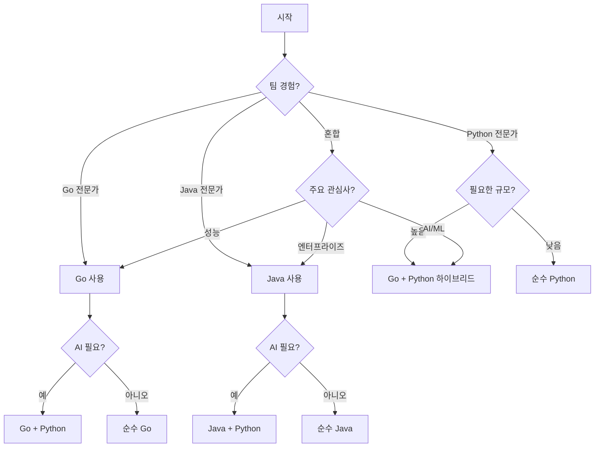

# Temporal: Java vs Python vs Go SDK 비교

Temporal 워크플로우를 위한 Java, Python, Go SDK 중 선택을 위한 종합 가이드입니다.

## 성능 비교

### 벤치마크 결과

| 지표 | Java SDK | Go SDK | Python SDK | 참고사항 |
|--------|----------|---------|------------|-------|
| **워크플로우 처리량** | 10,000+ workflows/sec | 15,000+ workflows/sec | 1,000-2,000 workflows/sec | Go가 가장 빠름, Python은 10배 느림 |
| **액티비티 실행** | <1ms 오버헤드 | <0.5ms 오버헤드 | 5-10ms 오버헤드 | Go의 오버헤드가 최소 |
| **메모리 사용량** | 200MB 기본 | 50MB 기본 | 100MB 기본 | Go가 가장 효율적 |
| **시작 시간** | 2-5초 | <500ms | <1초 | Go가 가장 빠른 시작 |
| **CPU 효율성** | 90%+ | 95%+ | 60-70% | Go가 최고의 동시성 |
| **워커 용량** | 1000+ 동시 실행 | 2000+ 동시 실행 | 100-200 동시 실행 | 워커 인스턴스당 |
| **바이너리 크기** | 50-100MB (JRE 포함) | 10-20MB | N/A (인터프리터) | Go가 작은 바이너리 생성 |

### 실제 성능

```yaml
문서 처리 파이프라인 (100만 문서):
  Go:
    - 처리 시간: 1.5시간
    - 필요 워커 수: 5-8 pods (각 2 CPU)
    - 워커당 메모리: 1GB
    - 비용: 최저

  Java:
    - 처리 시간: 2시간
    - 필요 워커 수: 10 pods (각 2 CPU)
    - 워커당 메모리: 2GB
    - 비용: 중간

  Python:
    - 처리 시간: 6-8시간
    - 필요 워커 수: 30-40 pods (각 2 CPU)
    - 워커당 메모리: 1GB
    - 비용: 최고 (더 많은 pod)
```

## 기능 비교

### Go SDK 장점

✅ **성능 챔피언**
- 네이티브 컴파일, 런타임 오버헤드 없음
- goroutines를 통한 뛰어난 동시성
- 최소한의 메모리 풋프린트
- 빠른 시작 시간

✅ **클라우드 네이티브 우선**
```go
// 자연스러운 Kubernetes 통합
type DocumentWorkflow struct {
    logger *zap.Logger
    metrics *prometheus.Registry
}

func (w *DocumentWorkflow) ProcessDocuments(ctx workflow.Context, input DocumentInput) (ProcessingResult, error) {
    // 내장 컨텍스트 처리
    ao := workflow.ActivityOptions{
        StartToCloseTimeout: 30 * time.Minute,
        RetryPolicy: &temporal.RetryPolicy{
            MaximumAttempts: 3,
        },
    }
    ctx = workflow.WithActivityOptions(ctx, ao)
    
    // 네이티브 goroutine 스타일 병렬 처리
    var futures []workflow.Future
    for _, batch := range createBatches(input.Documents, 100) {
        future := workflow.ExecuteActivity(ctx, ProcessBatch, batch)
        futures = append(futures, future)
    }
    
    // 효율적인 에러 처리
    var results []BatchResult
    for _, future := range futures {
        var result BatchResult
        if err := future.Get(ctx, &result); err != nil {
            return ProcessingResult{}, err
        }
        results = append(results, result)
    }
    
    return ProcessingResult{Results: results}, nil
}
```

✅ **개발자 경험**
- 간단하고 읽기 쉬운 구문
- 뛰어난 도구 (go fmt, go vet 등)
- 빠른 컴파일
- 훌륭한 표준 라이브러리

✅ **프로덕션 준비**
- 대규모에서 검증됨 (Uber, Netflix)
- 뛰어난 관찰성
- 낮은 운영 오버헤드
- 예측 가능한 성능

### Java SDK 장점

✅ **네이티브 Temporal 기능**
- 모든 기능을 갖춘 퍼스트 클래스 SDK
- 새로운 Temporal 기능에 즉시 접근
- 더 나은 워크플로우 버전 관리 지원
- 고급 패턴 (Saga, 로컬 액티비티)

✅ **타입 안전성**
```java
@WorkflowInterface
public interface DocumentWorkflow {
    @WorkflowMethod
    ProcessingResult process(DocumentInput input);
    
    @SignalMethod
    void pauseProcessing();
    
    @QueryMethod
    ProcessingStatus getStatus();
}
```

✅ **동시성**
- 액티비티에서 진정한 멀티스레딩
- 효율적인 리소스 활용
- CPU 집약적 작업에 더 적합

### Python SDK 장점

✅ **개발자 생산성**
```python
@workflow.defn
class DocumentWorkflow:
    @workflow.run
    async def run(self, input: DocumentInput) -> ProcessingResult:
        # 깨끗하고 읽기 쉬운 구문
        docs = await workflow.execute_activity(
            parse_csv, input.csv_path, 
            start_to_close_timeout=timedelta(minutes=5)
        )
        
        # 병렬 처리를 위한 리스트 컴프리헨션
        results = await asyncio.gather(*[
            workflow.execute_activity(process_doc, doc)
            for doc in docs
        ])
        
        return ProcessingResult(results)
```

✅ **AI/ML 통합**
- AI 라이브러리와의 네이티브 통합
- LangChain, Transformers의 직접 사용
- 원활한 데이터 과학 워크플로우

✅ **빠른 개발**
- 더 빠른 프로토타이핑
- 적은 보일러플레이트 코드
- 동적 타이핑의 유연성

## 코드 비교

### 워크플로우 정의

**Go:**
```go
// 깨끗하고 관용적인 Go
type DocumentRAGWorkflow interface {
    ProcessDocuments(ctx workflow.Context, csvPath string) (*RAGResult, error)
}

type documentRAGWorkflow struct{}

func (w *documentRAGWorkflow) ProcessDocuments(ctx workflow.Context, csvPath string) (*RAGResult, error) {
    logger := workflow.GetLogger(ctx)
    logger.Info("문서 처리 시작", "csvPath", csvPath)
    
    // 액티비티 구성
    ao := workflow.ActivityOptions{
        TaskQueue:           "document-processing",
        StartToCloseTimeout: 30 * time.Minute,
        RetryPolicy: &temporal.RetryPolicy{
            MaximumAttempts:    3,
            InitialInterval:    time.Second,
            MaximumInterval:    100 * time.Second,
            BackoffCoefficient: 2,
        },
    }
    ctx = workflow.WithActivityOptions(ctx, ao)
    
    // CSV 파싱
    var documents []Document
    err := workflow.ExecuteActivity(ctx, ParseCSVActivity, csvPath).Get(ctx, &documents)
    if err != nil {
        return nil, fmt.Errorf("CSV 파싱 실패: %w", err)
    }
    
    // 병렬 배치 처리
    batches := createBatches(documents, 100)
    futures := make([]workflow.Future, len(batches))
    
    for i, batch := range batches {
        futures[i] = workflow.ExecuteActivity(ctx, ProcessBatchActivity, batch)
    }
    
    // 결과 수집
    var allProcessed []ProcessedDoc
    for _, future := range futures {
        var batchResult []ProcessedDoc
        if err := future.Get(ctx, &batchResult); err != nil {
            logger.Error("배치 처리 실패", "error", err)
            continue // 다른 배치로 계속
        }
        allProcessed = append(allProcessed, batchResult...)
    }
    
    // RAG 구축
    var ragResult RAGResult
    err = workflow.ExecuteActivity(ctx, BuildRAGActivity, allProcessed).Get(ctx, &ragResult)
    if err != nil {
        return nil, fmt.Errorf("RAG 구축 실패: %w", err)
    }
    
    return &ragResult, nil
}
```

**Java:**
```java
@WorkflowInterface
public interface DocumentRAGWorkflow {
    @WorkflowMethod
    RAGResult processDocuments(String csvPath);
}

public class DocumentRAGWorkflowImpl implements DocumentRAGWorkflow {
    private final ActivityOptions options = ActivityOptions.newBuilder()
        .setStartToCloseTimeout(Duration.ofMinutes(30))
        .setRetryOptions(RetryOptions.newBuilder()
            .setMaximumAttempts(3)
            .build())
        .build();
    
    private final DocumentActivities activities = 
        Workflow.newActivityStub(DocumentActivities.class, options);
    
    @Override
    public RAGResult processDocuments(String csvPath) {
        List<Document> documents = activities.parseCSV(csvPath);
        
        List<Promise<ProcessedDoc>> promises = new ArrayList<>();
        for (List<Document> batch : partition(documents, 100)) {
            Promise<ProcessedDoc> promise = Async.function(
                activities::processBatch, batch
            );
            promises.add(promise);
        }
        
        List<ProcessedDoc> results = new ArrayList<>();
        for (Promise<ProcessedDoc> promise : promises) {
            results.add(promise.get());
        }
        
        return activities.buildRAG(results);
    }
}
```

**Python:**
```python
@workflow.defn
class DocumentRAGWorkflow:
    @workflow.run
    async def run(self, csv_path: str) -> RAGResult:
        # CSV 파싱
        documents = await workflow.execute_activity(
            parse_csv_activity,
            csv_path,
            start_to_close_timeout=timedelta(minutes=5),
            retry_policy=RetryPolicy(maximum_attempts=3)
        )
        
        # 병렬 배치 처리
        batches = [documents[i:i+100] for i in range(0, len(documents), 100)]
        
        processed_docs = await asyncio.gather(*[
            workflow.execute_activity(
                process_batch_activity,
                batch,
                start_to_close_timeout=timedelta(minutes=30)
            )
            for batch in batches
        ])
        
        # RAG 구축
        return await workflow.execute_activity(
            build_rag_activity,
            list(chain(*processed_docs))
        )
```

### 액티비티 구현

**Go:**
```go
type Activities struct {
    s3Client     *s3.Client
    vectorDB     VectorDB
    openAIClient *openai.Client
}

// 고성능 배치 처리
func (a *Activities) ProcessBatchActivity(ctx context.Context, batch []Document) ([]ProcessedDoc, error) {
    logger := activity.GetLogger(ctx)
    
    // 병렬 처리를 위한 goroutines 사용
    results := make([]ProcessedDoc, len(batch))
    errors := make([]error, len(batch))
    var wg sync.WaitGroup
    
    // 문서를 동시에 처리
    for i, doc := range batch {
        wg.Add(1)
        go func(idx int, document Document) {
            defer wg.Done()
            
            // 콘텐츠 추출
            content, err := a.extractContent(ctx, document)
            if err != nil {
                errors[idx] = err
                return
            }
            
            // 임베딩 생성
            embedding, err := a.generateEmbedding(ctx, content)
            if err != nil {
                errors[idx] = err
                return
            }
            
            // 요약 생성
            summary, err := a.generateSummary(ctx, content)
            if err != nil {
                errors[idx] = err
                return
            }
            
            results[idx] = ProcessedDoc{
                ID:        document.ID,
                Embedding: embedding,
                Summary:   summary,
                Metadata:  document.Metadata,
            }
        }(i, doc)
    }
    
    wg.Wait()
    
    // 에러 확인
    var succeeded []ProcessedDoc
    for i, err := range errors {
        if err != nil {
            logger.Error("문서 처리 실패", 
                "docID", batch[i].ID, 
                "error", err)
            activity.RecordHeartbeat(ctx, i) // 진행 상황 추적
            continue
        }
        succeeded = append(succeeded, results[i])
    }
    
    return succeeded, nil
}

// 효율적인 AI 통합
func (a *Activities) generateEmbedding(ctx context.Context, content string) ([]float32, error) {
    // OpenAI를 위한 효율적인 배치 처리
    resp, err := a.openAIClient.CreateEmbedding(ctx, openai.EmbeddingRequest{
        Model: "text-embedding-3-small",
        Input: content,
    })
    if err != nil {
        return nil, fmt.Errorf("임베딩 생성 실패: %w", err)
    }
    
    return resp.Data[0].Embedding, nil
}
```

**Java:**
```java
@ActivityInterface
public interface DocumentActivities {
    List<Document> parseCSV(String path);
    ProcessedDoc processBatch(List<Document> batch);
    RAGResult buildRAG(List<ProcessedDoc> docs);
}

@Component
public class DocumentActivitiesImpl implements DocumentActivities {
    @Autowired
    private S3Client s3Client;
    
    @Autowired
    private OpenAIService openAI;
    
    @Override
    public ProcessedDoc processBatch(List<Document> batch) {
        return batch.parallelStream()
            .map(doc -> {
                String content = extractContent(doc);
                List<Float> embedding = openAI.createEmbedding(content);
                String summary = openAI.summarize(content);
                return new ProcessedDoc(doc.getId(), embedding, summary);
            })
            .collect(Collectors.toList());
    }
}
```

**Python:**
```python
@activity.defn
async def process_batch_activity(batch: List[Document]) -> List[ProcessedDoc]:
    # AI 라이브러리와의 직접 통합
    from langchain.embeddings import OpenAIEmbeddings
    from langchain.chains.summarize import load_summarize_chain
    
    embeddings_model = OpenAIEmbeddings()
    summarize_chain = load_summarize_chain(llm=ChatOpenAI())
    
    processed = []
    for doc in batch:
        # 타입에 따른 콘텐츠 추출
        content = await extract_content(doc)
        
        # 임베딩 생성
        embedding = await embeddings_model.aembed_documents([content])
        
        # 요약 생성
        summary = await summarize_chain.arun(content)
        
        processed.append(ProcessedDoc(
            id=doc.id,
            embedding=embedding[0],
            summary=summary
        ))
    
    return processed
```

## 의사결정 매트릭스

### Go를 선택해야 할 때:

✅ **성능이 중요 + 클라우드 네이티브**
- 최소 리소스로 최대 성능 필요
- 마이크로서비스 아키텍처 구축
- Kubernetes 네이티브 배포
- 비용 최적화가 중요

✅ **팀 & 문화**
- 팀에 강력한 Go 전문성
- 클라우드 네이티브/DevOps 문화
- 간단하고 명시적인 코드 선호
- 분산 시스템 구축

✅ **기술 요구사항**
- 높은 동시성 요구사항
- 낮은 지연 시간 요구사항 (<100ms)
- 최소 메모리 풋프린트 필요
- 빠른 시작 시간이 중요

### Java를 선택해야 할 때:

✅ **성능이 중요**
- 매일 수백만 개의 문서 처리
- 서브초 지연 시간 요구사항
- 높은 처리량 필요 (>1000 workflows/sec)
- CPU 집약적 처리

✅ **엔터프라이즈 요구사항**
- 강력한 타이핑 요구사항
- 복잡한 비즈니스 로직
- 장기 유지보수성
- 대규모 엔지니어링 팀

✅ **인프라**
- 이미 JVM 생태계 사용 중
- Spring Boot 마이크로서비스
- 기존 Java 전문성

### Python을 선택해야 할 때:

✅ **AI/ML 중심**
- 주로 LangChain, Transformers 사용
- 데이터 과학 팀 소유권
- 실험/연구 프로젝트
- 빠른 프로토타이핑 필요

✅ **개발 속도**
- 소규모 팀 또는 스타트업
- 빠른 반복 주기
- 간단한 워크플로우 로직
- 통합 중심 워크플로우

✅ **리소스 제약**
- 제한된 메모리 가용
- 서버리스 환경
- 개발 속도 > 성능

## 언어 비교 요약

| 측면 | Go | Java | Python |
|--------|-----|------|--------|
| **성능** | ⭐⭐⭐⭐⭐ 최고 | ⭐⭐⭐⭐ 우수 | ⭐⭐ 양호 |
| **메모리 사용량** | ⭐⭐⭐⭐⭐ 최소 | ⭐⭐⭐ 보통 | ⭐⭐⭐⭐ 낮음 |
| **개발자 생산성** | ⭐⭐⭐⭐ 높음 | ⭐⭐⭐ 보통 | ⭐⭐⭐⭐⭐ 최고 |
| **AI/ML 라이브러리** | ⭐⭐ 제한적 | ⭐⭐⭐ 양호 | ⭐⭐⭐⭐⭐ 최고 |
| **타입 안전성** | ⭐⭐⭐⭐ 강함 | ⭐⭐⭐⭐⭐ 가장 강함 | ⭐⭐ 약함 |
| **동시성** | ⭐⭐⭐⭐⭐ 네이티브 | ⭐⭐⭐⭐ 양호 | ⭐⭐ 제한적 |
| **시작 시간** | ⭐⭐⭐⭐⭐ 즉시 | ⭐⭐ 느림 | ⭐⭐⭐⭐ 빠름 |
| **생태계** | ⭐⭐⭐ 성장 중 | ⭐⭐⭐⭐⭐ 성숙 | ⭐⭐⭐⭐ 풍부 |
| **클라우드 네이티브** | ⭐⭐⭐⭐⭐ 내장 | ⭐⭐⭐ 양호 | ⭐⭐⭐ 양호 |
| **학습 곡선** | ⭐⭐⭐⭐ 쉬움 | ⭐⭐ 가파름 | ⭐⭐⭐⭐⭐ 가장 쉬움 |

## 하이브리드 접근법

### 접근법 1: Go + Python (최대 효율성을 위해 권장)

```yaml
아키텍처:
  워크플로우: Go (성능, 신뢰성)
  AI 액티비티: Python (라이브러리, 유연성)
  
이점:
  - 가장 빠른 워크플로우 실행
  - 최고의 AI/ML 라이브러리 접근
  - 최소 리소스 사용
  - 클라우드 네이티브 배포
```

**예제 설정:**
```go
// Python AI 액티비티를 사용한 Go 워크플로우
func (w *documentWorkflow) ProcessDocuments(ctx workflow.Context, input Input) (*Result, error) {
    // Go에서 고성능 데이터 처리
    data := workflow.ExecuteActivity(ctx, ExtractDataActivity, input).Get(ctx, &data)
    
    // Python gRPC 서비스를 통한 AI 처리
    aiResult := workflow.ExecuteActivity(ctx, PythonAIActivity, data).Get(ctx, &aiResult)
    
    // Go에서 효율적인 저장 작업
    return workflow.ExecuteActivity(ctx, StoreResultsActivity, aiResult).Get(ctx, &result)
}
```

### 접근법 2: Java + Python (엔터프라이즈 선택)

```yaml
아키텍처:
  워크플로우: Java (성능, 신뢰성)
  AI 액티비티: Python (라이브러리, 유연성)
  
통신:
  - Java와 Python 서비스 간 gRPC
  - 공유 메시지 형식 (Protocol Buffers)
  - 오케스트레이션 레이어로서 Temporal
```

**예제 설정:**
```java
// Java 워크플로우
public class HybridDocumentWorkflow {
    // gRPC를 통한 Python AI 액티비티
    private final AIActivities aiActivities = 
        Workflow.newActivityStub(AIActivities.class, aiOptions);
    
    // Java 고성능 액티비티
    private final DataActivities dataActivities = 
        Workflow.newActivityStub(DataActivities.class, dataOptions);
    
    public Result process(Input input) {
        // Java에서 빠른 데이터 처리
        Data data = dataActivities.extractData(input);
        
        // Python에서 AI 처리
        AIResult aiResult = aiActivities.processWithAI(data);
        
        // Java에서 비즈니스 로직
        return processResult(aiResult);
    }
}
```

## 마이그레이션 전략

### Python에서 Java로 마이그레이션

**마이그레이션 시기:**
- 워크플로우 실행 시간 >30초
- 100개 워커 이상으로 확장 필요
- CPU 사용률이 지속적으로 >80%

**마이그레이션 경로:**
1. 성능이 중요한 워크플로우부터 시작
2. AI 중심 액티비티는 Python 유지
3. 점진적으로 액티비티를 Java로 포팅
4. 실험을 위해 Python 유지

### Java에서 Python으로 마이그레이션

**고려 시기:**
- AI/ML이 주요 초점이 됨
- 팀 전문성이 Python으로 이동
- 빠른 실험 필요
- 통합 복잡성 증가

## 사용 사례별 권장사항

### 문서 처리 파이프라인

**순수 Go 접근법:**
- 최적: 최대 성능, 클라우드 네이티브 환경
- 예: 고빈도 거래 문서 분석
- 규모: 최소 리소스로 일일 100만+ 문서

**순수 Java 접근법:**
- 최적: 엔터프라이즈 환경, 복잡한 비즈니스 로직
- 예: 규정 준수가 포함된 은행 문서 처리
- 규모: 일일 10만-100만 문서

**순수 Python 접근법:**
- 최적: AI 중심, 실험적, 빠른 프로토타이핑
- 예: 연구소 문서 분석
- 규모: 일일 <10만 문서

**하이브리드 접근법:**
- **Go + Python**: 최대 효율성 + AI 기능
- **Java + Python**: 엔터프라이즈 표준 + AI 유연성

### 샘플 아키텍처 결정

```yaml
소규모 (<일일 1만 문서):
  권장사항: 순수 Python
  이유:
    - 빠른 개발이 성능보다 중요
    - 직접 AI 라이브러리 통합
    - 간단한 배포

중규모 (일일 1만-10만 문서):
  권장사항: Go + Python 하이브리드
  이유:
    - 성능이 중요하지만 중요하지 않음
    - 좋은 AI 통합 필요
    - 비용 효율적인 확장

대규모 (일일 10만-100만 문서):
  권장사항: 순수 Go 또는 Go + Python
  이유:
    - 성능이 중요
    - 리소스 비용이 상당함
    - 수평 확장 필요

엔터프라이즈 규모 (일일 100만+ 문서):
  권장사항: 워크플로우는 Go, AI는 Python
  이유:
    - 최대 성능 필요
    - 복잡한 AI 처리 요구
    - 다중 지역 배포
    - 비용 최적화가 중요
```

## 결론

### 빠른 결정 가이드



### 최종 권장사항

1. **Go**: 클라우드 네이티브, 고성능 시스템을 위한 첫 번째 선택
2. **Java**: 기존 JVM 인프라가 있는 엔터프라이즈 환경에 최적
3. **Python**: AI/ML 중심 워크플로우와 빠른 프로토타이핑에 이상적
4. **하이브리드**: 성능과 유연성을 결합한 최적의 선택인 경우가 많음

핵심은 특정 요구사항에 언어를 일치시키는 것입니다:
- **성능 요구** → Go
- **엔터프라이즈 표준** → Java
- **AI/ML 중심** → Python
- **모든 것의 최고** → 하이브리드 접근법