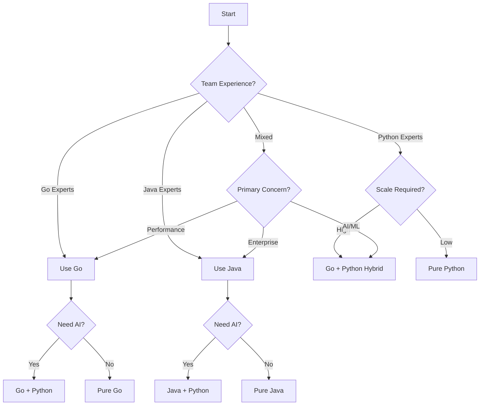

# Temporal: Java vs Python vs Go SDK Comparison

A comprehensive guide for choosing between Java, Python, and Go SDKs for Temporal workflows.

## Performance Comparison

### Benchmark Results

| Metric | Java SDK | Go SDK | Python SDK | Notes |
|--------|----------|---------|------------|-------|
| **Workflow Throughput** | 10,000+ workflows/sec | 15,000+ workflows/sec | 1,000-2,000 workflows/sec | Go fastest, Python 10x slower |
| **Activity Execution** | <1ms overhead | <0.5ms overhead | 5-10ms overhead | Go has minimal overhead |
| **Memory Usage** | 200MB base | 50MB base | 100MB base | Go most efficient |
| **Startup Time** | 2-5 seconds | <500ms | <1 second | Go fastest startup |
| **CPU Efficiency** | 90%+ | 95%+ | 60-70% | Go best concurrency |
| **Worker Capacity** | 1000+ concurrent | 2000+ concurrent | 100-200 concurrent | Per worker instance |
| **Binary Size** | 50-100MB (with JRE) | 10-20MB | N/A (interpreted) | Go produces small binaries |

### Real-World Performance

```yaml
Document Processing Pipeline (1M documents):
  Go:
    - Processing Time: 1.5 hours
    - Workers Needed: 5-8 pods (2 CPU each)
    - Memory per Worker: 1GB
    - Cost: Lowest
    
  Java:
    - Processing Time: 2 hours
    - Workers Needed: 10 pods (2 CPU each)
    - Memory per Worker: 2GB
    - Cost: Medium
    
  Python:
    - Processing Time: 6-8 hours
    - Workers Needed: 30-40 pods (2 CPU each)
    - Memory per Worker: 1GB
    - Cost: Highest (more pods)
```

## Feature Comparison

### Go SDK Advantages

✅ **Performance Champion**
- Native compilation, no runtime overhead
- Excellent concurrency with goroutines
- Minimal memory footprint
- Fast startup times

✅ **Cloud-Native First**
```go
// Natural Kubernetes integration
type DocumentWorkflow struct {
    logger *zap.Logger
    metrics *prometheus.Registry
}

func (w *DocumentWorkflow) ProcessDocuments(ctx workflow.Context, input DocumentInput) (ProcessingResult, error) {
    // Built-in context handling
    ao := workflow.ActivityOptions{
        StartToCloseTimeout: 30 * time.Minute,
        RetryPolicy: &temporal.RetryPolicy{
            MaximumAttempts: 3,
        },
    }
    ctx = workflow.WithActivityOptions(ctx, ao)
    
    // Native goroutine-style parallelism
    var futures []workflow.Future
    for _, batch := range createBatches(input.Documents, 100) {
        future := workflow.ExecuteActivity(ctx, ProcessBatch, batch)
        futures = append(futures, future)
    }
    
    // Efficient error handling
    var results []BatchResult
    for _, future := range futures {
        var result BatchResult
        if err := future.Get(ctx, &result); err != nil {
            return ProcessingResult{}, err
        }
        results = append(results, result)
    }
    
    return ProcessingResult{Results: results}, nil
}
```

✅ **Developer Experience**
- Simple, readable syntax
- Excellent tooling (go fmt, go vet, etc.)
- Fast compilation
- Great standard library

✅ **Production Ready**
- Battle-tested at scale (Uber, Netflix)
- Excellent observability
- Low operational overhead
- Predictable performance

### Java SDK Advantages

✅ **Native Temporal Features**
- First-class SDK with all features
- Immediate access to new Temporal features
- Better workflow versioning support
- Advanced patterns (Saga, local activities)

✅ **Type Safety**
```java
@WorkflowInterface
public interface DocumentWorkflow {
    @WorkflowMethod
    ProcessingResult process(DocumentInput input);
    
    @SignalMethod
    void pauseProcessing();
    
    @QueryMethod
    ProcessingStatus getStatus();
}
```

✅ **Concurrency**
- True multi-threading in activities
- Efficient resource utilization
- Better for CPU-intensive tasks

### Python SDK Advantages

✅ **Developer Productivity**
```python
@workflow.defn
class DocumentWorkflow:
    @workflow.run
    async def run(self, input: DocumentInput) -> ProcessingResult:
        # Clean, readable syntax
        docs = await workflow.execute_activity(
            parse_csv, input.csv_path, 
            start_to_close_timeout=timedelta(minutes=5)
        )
        
        # List comprehension for parallel processing
        results = await asyncio.gather(*[
            workflow.execute_activity(process_doc, doc)
            for doc in docs
        ])
        
        return ProcessingResult(results)
```

✅ **AI/ML Integration**
- Native integration with AI libraries
- Direct use of LangChain, Transformers
- Seamless data science workflows

✅ **Rapid Development**
- Faster prototyping
- Less boilerplate code
- Dynamic typing flexibility

## Code Comparison

### Workflow Definition

**Go:**
```go
// Clean, idiomatic Go
type DocumentRAGWorkflow interface {
    ProcessDocuments(ctx workflow.Context, csvPath string) (*RAGResult, error)
}

type documentRAGWorkflow struct{}

func (w *documentRAGWorkflow) ProcessDocuments(ctx workflow.Context, csvPath string) (*RAGResult, error) {
    logger := workflow.GetLogger(ctx)
    logger.Info("Starting document processing", "csvPath", csvPath)
    
    // Configure activities
    ao := workflow.ActivityOptions{
        TaskQueue:           "document-processing",
        StartToCloseTimeout: 30 * time.Minute,
        RetryPolicy: &temporal.RetryPolicy{
            MaximumAttempts:    3,
            InitialInterval:    time.Second,
            MaximumInterval:    100 * time.Second,
            BackoffCoefficient: 2,
        },
    }
    ctx = workflow.WithActivityOptions(ctx, ao)
    
    // Parse CSV
    var documents []Document
    err := workflow.ExecuteActivity(ctx, ParseCSVActivity, csvPath).Get(ctx, &documents)
    if err != nil {
        return nil, fmt.Errorf("failed to parse CSV: %w", err)
    }
    
    // Process in parallel batches
    batches := createBatches(documents, 100)
    futures := make([]workflow.Future, len(batches))
    
    for i, batch := range batches {
        futures[i] = workflow.ExecuteActivity(ctx, ProcessBatchActivity, batch)
    }
    
    // Collect results
    var allProcessed []ProcessedDoc
    for _, future := range futures {
        var batchResult []ProcessedDoc
        if err := future.Get(ctx, &batchResult); err != nil {
            logger.Error("Batch processing failed", "error", err)
            continue // Continue with other batches
        }
        allProcessed = append(allProcessed, batchResult...)
    }
    
    // Build RAG
    var ragResult RAGResult
    err = workflow.ExecuteActivity(ctx, BuildRAGActivity, allProcessed).Get(ctx, &ragResult)
    if err != nil {
        return nil, fmt.Errorf("failed to build RAG: %w", err)
    }
    
    return &ragResult, nil
}
```

**Java:**
```java
@WorkflowInterface
public interface DocumentRAGWorkflow {
    @WorkflowMethod
    RAGResult processDocuments(String csvPath);
}

public class DocumentRAGWorkflowImpl implements DocumentRAGWorkflow {
    private final ActivityOptions options = ActivityOptions.newBuilder()
        .setStartToCloseTimeout(Duration.ofMinutes(30))
        .setRetryOptions(RetryOptions.newBuilder()
            .setMaximumAttempts(3)
            .build())
        .build();
    
    private final DocumentActivities activities = 
        Workflow.newActivityStub(DocumentActivities.class, options);
    
    @Override
    public RAGResult processDocuments(String csvPath) {
        List<Document> documents = activities.parseCSV(csvPath);
        
        List<Promise<ProcessedDoc>> promises = new ArrayList<>();
        for (List<Document> batch : partition(documents, 100)) {
            Promise<ProcessedDoc> promise = Async.function(
                activities::processBatch, batch
            );
            promises.add(promise);
        }
        
        List<ProcessedDoc> results = new ArrayList<>();
        for (Promise<ProcessedDoc> promise : promises) {
            results.add(promise.get());
        }
        
        return activities.buildRAG(results);
    }
}
```

**Python:**
```python
@workflow.defn
class DocumentRAGWorkflow:
    @workflow.run
    async def run(self, csv_path: str) -> RAGResult:
        # Parse CSV
        documents = await workflow.execute_activity(
            parse_csv_activity,
            csv_path,
            start_to_close_timeout=timedelta(minutes=5),
            retry_policy=RetryPolicy(maximum_attempts=3)
        )
        
        # Process in parallel batches
        batches = [documents[i:i+100] for i in range(0, len(documents), 100)]
        
        processed_docs = await asyncio.gather(*[
            workflow.execute_activity(
                process_batch_activity,
                batch,
                start_to_close_timeout=timedelta(minutes=30)
            )
            for batch in batches
        ])
        
        # Build RAG
        return await workflow.execute_activity(
            build_rag_activity,
            list(chain(*processed_docs))
        )
```

### Activity Implementation

**Go:**
```go
type Activities struct {
    s3Client     *s3.Client
    vectorDB     VectorDB
    openAIClient *openai.Client
}

// High-performance batch processing
func (a *Activities) ProcessBatchActivity(ctx context.Context, batch []Document) ([]ProcessedDoc, error) {
    logger := activity.GetLogger(ctx)
    
    // Use goroutines for parallel processing
    results := make([]ProcessedDoc, len(batch))
    errors := make([]error, len(batch))
    var wg sync.WaitGroup
    
    // Process documents concurrently
    for i, doc := range batch {
        wg.Add(1)
        go func(idx int, document Document) {
            defer wg.Done()
            
            // Extract content
            content, err := a.extractContent(ctx, document)
            if err != nil {
                errors[idx] = err
                return
            }
            
            // Generate embedding
            embedding, err := a.generateEmbedding(ctx, content)
            if err != nil {
                errors[idx] = err
                return
            }
            
            // Generate summary
            summary, err := a.generateSummary(ctx, content)
            if err != nil {
                errors[idx] = err
                return
            }
            
            results[idx] = ProcessedDoc{
                ID:        document.ID,
                Embedding: embedding,
                Summary:   summary,
                Metadata:  document.Metadata,
            }
        }(i, doc)
    }
    
    wg.Wait()
    
    // Check for errors
    var succeeded []ProcessedDoc
    for i, err := range errors {
        if err != nil {
            logger.Error("Failed to process document", 
                "docID", batch[i].ID, 
                "error", err)
            activity.RecordHeartbeat(ctx, i) // Progress tracking
            continue
        }
        succeeded = append(succeeded, results[i])
    }
    
    return succeeded, nil
}

// Efficient AI integration
func (a *Activities) generateEmbedding(ctx context.Context, content string) ([]float32, error) {
    // Efficient batching for OpenAI
    resp, err := a.openAIClient.CreateEmbedding(ctx, openai.EmbeddingRequest{
        Model: "text-embedding-3-small",
        Input: content,
    })
    if err != nil {
        return nil, fmt.Errorf("embedding generation failed: %w", err)
    }
    
    return resp.Data[0].Embedding, nil
}
```

**Java:**
```java
@ActivityInterface
public interface DocumentActivities {
    List<Document> parseCSV(String path);
    ProcessedDoc processBatch(List<Document> batch);
    RAGResult buildRAG(List<ProcessedDoc> docs);
}

@Component
public class DocumentActivitiesImpl implements DocumentActivities {
    @Autowired
    private S3Client s3Client;
    
    @Autowired
    private OpenAIService openAI;
    
    @Override
    public ProcessedDoc processBatch(List<Document> batch) {
        return batch.parallelStream()
            .map(doc -> {
                String content = extractContent(doc);
                List<Float> embedding = openAI.createEmbedding(content);
                String summary = openAI.summarize(content);
                return new ProcessedDoc(doc.getId(), embedding, summary);
            })
            .collect(Collectors.toList());
    }
}
```

**Python:**
```python
@activity.defn
async def process_batch_activity(batch: List[Document]) -> List[ProcessedDoc]:
    # Direct integration with AI libraries
    from langchain.embeddings import OpenAIEmbeddings
    from langchain.chains.summarize import load_summarize_chain
    
    embeddings_model = OpenAIEmbeddings()
    summarize_chain = load_summarize_chain(llm=ChatOpenAI())
    
    processed = []
    for doc in batch:
        # Extract content based on type
        content = await extract_content(doc)
        
        # Generate embeddings
        embedding = await embeddings_model.aembed_documents([content])
        
        # Generate summary
        summary = await summarize_chain.arun(content)
        
        processed.append(ProcessedDoc(
            id=doc.id,
            embedding=embedding[0],
            summary=summary
        ))
    
    return processed
```

## Decision Matrix

### Choose Go When:

✅ **Performance Critical + Cloud Native**
- Need maximum performance with minimal resources
- Building microservices architecture
- Kubernetes-native deployment
- Cost optimization is important

✅ **Team & Culture**
- Strong Go expertise in team
- Cloud-native/DevOps culture
- Preference for simple, explicit code
- Building distributed systems

✅ **Technical Requirements**
- High concurrency requirements
- Low latency requirements (<100ms)
- Minimal memory footprint needed
- Fast startup times critical

### Choose Java When:

✅ **Performance Critical**
- Processing millions of documents daily
- Sub-second latency requirements
- High throughput needed (>1000 workflows/sec)
- CPU-intensive processing

✅ **Enterprise Requirements**
- Strong typing requirements
- Complex business logic
- Long-term maintainability
- Large engineering teams

✅ **Infrastructure**
- Already using JVM ecosystem
- Spring Boot microservices
- Existing Java expertise

### Choose Python When:

✅ **AI/ML Heavy**
- Primarily using LangChain, Transformers
- Data science team ownership
- Experimental/research projects
- Rapid prototyping needed

✅ **Developer Velocity**
- Small team or startup
- Quick iteration cycles
- Simple workflow logic
- Integration-heavy workflows

✅ **Resource Constraints**
- Limited memory available
- Serverless environments
- Development speed > performance

## Language Comparison Summary

| Aspect | Go | Java | Python |
|--------|-----|------|--------|
| **Performance** | ⭐⭐⭐⭐⭐ Best | ⭐⭐⭐⭐ Excellent | ⭐⭐ Good |
| **Memory Usage** | ⭐⭐⭐⭐⭐ Minimal | ⭐⭐⭐ Moderate | ⭐⭐⭐⭐ Low |
| **Developer Productivity** | ⭐⭐⭐⭐ High | ⭐⭐⭐ Moderate | ⭐⭐⭐⭐⭐ Highest |
| **AI/ML Libraries** | ⭐⭐ Limited | ⭐⭐⭐ Good | ⭐⭐⭐⭐⭐ Best |
| **Type Safety** | ⭐⭐⭐⭐ Strong | ⭐⭐⭐⭐⭐ Strongest | ⭐⭐ Weak |
| **Concurrency** | ⭐⭐⭐⭐⭐ Native | ⭐⭐⭐⭐ Good | ⭐⭐ Limited |
| **Startup Time** | ⭐⭐⭐⭐⭐ Instant | ⭐⭐ Slow | ⭐⭐⭐⭐ Fast |
| **Ecosystem** | ⭐⭐⭐ Growing | ⭐⭐⭐⭐⭐ Mature | ⭐⭐⭐⭐ Rich |
| **Cloud Native** | ⭐⭐⭐⭐⭐ Built-in | ⭐⭐⭐ Good | ⭐⭐⭐ Good |
| **Learning Curve** | ⭐⭐⭐⭐ Easy | ⭐⭐ Steep | ⭐⭐⭐⭐⭐ Easiest |

## Hybrid Approaches

### Approach 1: Go + Python (Recommended for Maximum Efficiency)

```yaml
Architecture:
  Workflows: Go (performance, reliability)
  AI Activities: Python (libraries, flexibility)
  
Benefits:
  - Fastest workflow execution
  - Best AI/ML library access
  - Minimal resource usage
  - Cloud-native deployment
```

**Example Setup:**
```go
// Go Workflow with Python AI activities
func (w *documentWorkflow) ProcessDocuments(ctx workflow.Context, input Input) (*Result, error) {
    // High-performance data processing in Go
    data := workflow.ExecuteActivity(ctx, ExtractDataActivity, input).Get(ctx, &data)
    
    // AI processing via Python gRPC service
    aiResult := workflow.ExecuteActivity(ctx, PythonAIActivity, data).Get(ctx, &aiResult)
    
    // Efficient storage operations in Go
    return workflow.ExecuteActivity(ctx, StoreResultsActivity, aiResult).Get(ctx, &result)
}
```

### Approach 2: Java + Python (Enterprise Choice)

```yaml
Architecture:
  Workflows: Java (performance, reliability)
  AI Activities: Python (libraries, flexibility)
  
Communication:
  - gRPC between Java and Python services
  - Shared message formats (Protocol Buffers)
  - Temporal as orchestration layer
```

**Example Setup:**
```java
// Java Workflow
public class HybridDocumentWorkflow {
    // Python AI activities via gRPC
    private final AIActivities aiActivities = 
        Workflow.newActivityStub(AIActivities.class, aiOptions);
    
    // Java high-performance activities
    private final DataActivities dataActivities = 
        Workflow.newActivityStub(DataActivities.class, dataOptions);
    
    public Result process(Input input) {
        // Fast data processing in Java
        Data data = dataActivities.extractData(input);
        
        // AI processing in Python
        AIResult aiResult = aiActivities.processWithAI(data);
        
        // Business logic in Java
        return processResult(aiResult);
    }
}
```

## Migration Strategies

### Python to Java Migration

**When to Migrate:**
- Workflow execution time >30 seconds
- Need to scale beyond 100 workers
- CPU utilization >80% consistently

**Migration Path:**
1. Start with performance-critical workflows
2. Keep Python for AI-heavy activities
3. Gradually port activities to Java
4. Maintain Python for experimentation

### Java to Python Migration

**When to Consider:**
- AI/ML becomes primary focus
- Team expertise shifts to Python
- Rapid experimentation needed
- Integration complexity increases

## Recommendations by Use Case

### Document Processing Pipeline

**Pure Go Approach:**
- Best for: Maximum performance, cloud-native environments
- Example: High-frequency trading document analysis
- Scale: 1M+ documents/day with minimal resources

**Pure Java Approach:**
- Best for: Enterprise environments, complex business logic
- Example: Banking document processing with compliance
- Scale: 100K-1M documents/day

**Pure Python Approach:**
- Best for: AI-heavy, experimental, rapid prototyping
- Example: Research lab document analysis
- Scale: <100K documents/day

**Hybrid Approaches:**
- **Go + Python**: Maximum efficiency + AI capabilities
- **Java + Python**: Enterprise standards + AI flexibility

### Sample Architecture Decisions

```yaml
Small Scale (<10K docs/day):
  Recommendation: Pure Python
  Reasoning:
    - Fast development more important than performance
    - Direct AI library integration
    - Simple deployment

Medium Scale (10K-100K docs/day):
  Recommendation: Go + Python Hybrid
  Reasoning:
    - Performance matters but not critical
    - Need good AI integration
    - Cost-effective scaling

Large Scale (100K-1M docs/day):
  Recommendation: Pure Go or Go + Python
  Reasoning:
    - Performance is critical
    - Resource costs significant
    - Need horizontal scaling

Enterprise Scale (1M+ docs/day):
  Recommendation: Go for workflows, Python for AI
  Reasoning:
    - Maximum performance required
    - Complex AI processing needs
    - Multi-region deployment
    - Cost optimization critical
```

## Conclusion

### Quick Decision Guide



### Final Recommendations

1. **Go**: First choice for cloud-native, high-performance systems
2. **Java**: Best for enterprise environments with existing JVM infrastructure
3. **Python**: Ideal for AI/ML-heavy workflows and rapid prototyping
4. **Hybrid**: Often the optimal choice, combining performance with flexibility

The key is matching the language to your specific requirements:
- **Performance needs** → Go
- **Enterprise standards** → Java
- **AI/ML focus** → Python
- **Best of all** → Hybrid approach